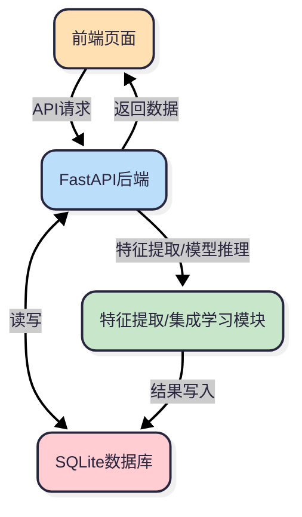
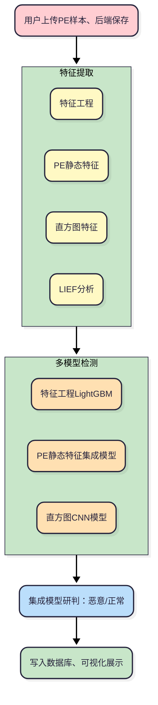
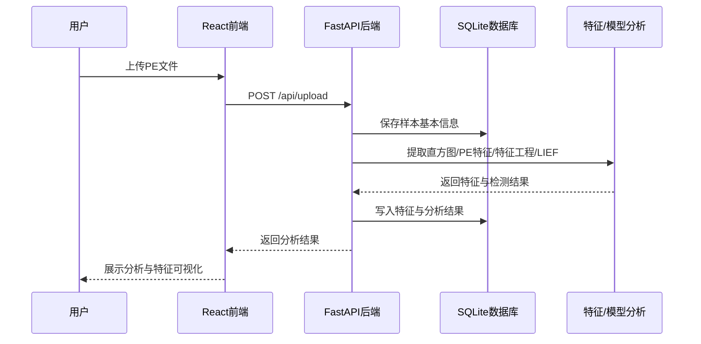
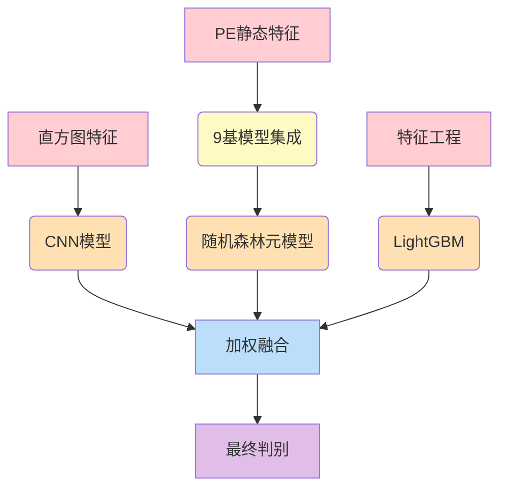

# 恶意PE软件特征检测与识别系统 - 系统架构说明书

## 目录

- [1. 系统总体架构](#1-系统总体架构)
- [2. 模块关系与集成学习特征分析流程](#2-模块关系与集成学习特征分析流程)
- [3. 功能点、接口与前端展示总览表](#3-功能点接口与前端展示总览表)
- [4. 各模块详细功能与关键实现](#4-各模块详细功能与关键实现)
- [5. 数据库表结构与字段说明](#5-数据库表结构与字段说明)
- [6. 系统主要流程图（Mermaid）](#6-系统主要流程图mermaid)

---

## 1. 系统总体架构

本系统采用**前后端分离**架构，分为：

- **前端（frontend）**：基于 React + UmiJS + Ant Design + ECharts，负责页面交互、数据可视化、样本管理、特征展示、模型分析等。
- **后端（backend）**：基于 FastAPI，负责样本上传、特征提取、恶意检测、数据库管理、模型分析等。
- **数据库**：SQLite，存储样本信息、特征数据、分析结果等。

### 各模块关系



- 前端通过API与后端交互，后端负责特征提取、模型推理、数据存储。
- 特征提取和集成学习模块由后端统一调度，结果写入数据库并返回前端。

---

## 2. 模块关系与集成学习特征分析流程

### 系统主要模块

- **样本管理**：上传、列表、搜索、详情
- **特征提取**：直方图特征、PE静态特征、特征工程、LIEF深度分析
- **集成学习与检测**：多模型集成，恶意/正常判别
- **数据可视化**：仪表盘、特征分布、模型性能
- **模型分析**：各模型性能、特征重要性展示

### 集成学习特征分析流程




- 上传样本后，后端自动完成多种特征提取。
- 各特征分别送入对应的机器学习模型。
- 多模型结果通过加权融合，输出最终判别。
- 所有特征与结果写入数据库，前端可随时查询与可视化。

---

## 3. 功能点、接口与前端展示总览表

| 编号 | 功能点         | 后端接口                | 前端页面/组件                | 说明                         |
|------|----------------|-------------------------|------------------------------|------------------------------|
| 1    | 样本上传       | POST /api/upload        | /upload, UploadPage          | 上传PE文件并自动分析         |
| 2    | 样本列表       | GET /api/samples        | /samples, SamplesPage        | 展示所有样本，支持搜索       |
| 3    | 样本详情       | GET /api/samples/{id}   | /samples/detail, SampleDetailPage | 展示单个样本所有特征与分析 |
| 4    | 仪表盘         | GET /api/samples, /api/stats | /dashboard, DashboardPage | 样本统计、分布、趋势        |
| 5    | 模型分析       | GET /api/model/analysis | /model, ModelAnalysisPage    | 展示各模型性能与特征重要性   |
| 6    | 特征可视化     | -                       | ByteHistogramChart, EntropyHistogramChart, PEFeaturesCard, FeatureEngineeringCard, LiefAnalysisCard | 直方图、雷达图、表格等      |

### 主要接口详细表

| 接口路径                | 方法 | 参数         | 返回内容         | 说明                   |
|------------------------|------|--------------|------------------|------------------------|
| /api/upload            | POST | file         | {sample_id, ...} | 上传并分析样本         |
| /api/samples           | GET  | -            | 样本列表         | 获取所有样本           |
| /api/samples/{id}      | GET  | id           | 样本详细信息     | 获取单个样本所有特征   |
| /api/stats             | GET  | -            | 统计信息         | 样本总数、恶意数等     |
| /api/model/analysis    | GET  | -            | 模型分析数据     | 各模型性能、特征重要性 |

---

## 4. 各模块详细功能与关键实现

### 4.1 样本管理模块

- **功能**：上传、列表、搜索、详情
- **实现**：
  - 上传：`/api/upload`，前端`UploadPage`，后端保存文件、提取特征、写入数据库
  - 列表/搜索：`/api/samples`，前端`SamplesPage`，支持文件名/哈希搜索
  - 详情：`/api/samples/{id}`，前端`SampleDetailPage`，展示所有特征与分析

### 4.2 特征提取模块

- **直方图特征**：字节分布直方图、字节熵直方图（512维），用于CNN模型
  - 关键函数：`ByteHistogram().raw_features`、`ByteEntropyHistogram().raw_features`
- **PE静态特征**：PE头、节区、导出表等（967维），用于集成学习
  - 关键函数：`PEFeatureExtractor`、`SectionInfo.process_raw_features`
- **特征工程**：节区统计、字符串匹配、Yara、Opcode等（56维），用于LightGBM
  - 关键函数：`Feature_engineering.get_feature_engineering`
- **LIEF深度分析**：用LIEF库解析PE结构，辅助特征工程与可视化
  - 关键函数：`lief.PE.parse`，`LiefFeatureExtractor`

### 4.3 集成学习与检测模块

- **直方图CNN模型**：输入512维特征，卷积提取空间分布，检测加密/混淆
- **PE静态特征集成模型**：9个基模型（LR、XGB、RF等）+ 随机森林元模型，堆叠融合
- **特征工程LightGBM模型**：处理专家特征，提升对挖矿/加壳等检测能力
- **加权融合**：最终结果由各模型加权投票，提升准确率
- **关键逻辑**：多进程特征提取、K折交叉验证、特征哈希、模型堆叠

### 4.4 数据可视化与前端展示

- **仪表盘**：样本统计、分布饼图、大小分布柱状图
- **样本详情**：分Tab展示直方图、PE特征、LIEF分析、特征工程
- **特征可视化**：ECharts绘制直方图、雷达图、特征分布
- **模型分析**：各模型性能、混淆矩阵、特征重要性条形图

---

## 5. 数据库表结构与字段说明

### 5.1 样本信息表（samples）

| 编号 | 字段名              | 数据类型   | 非空 | 主键 | 注释           |
|------|---------------------|------------|------|------|----------------|
| 1    | id                  | INTEGER    | 否   | 是   | 样本ID         |
| 2    | file_hash           | TEXT       | 是   | 否   | 文件MD5哈希    |
| 3    | file_name           | TEXT       | 否   | 否   | 文件名         |
| 4    | file_size           | INTEGER    | 否   | 否   | 文件大小（字节）|
| 5    | is_malicious        | INTEGER    | 否   | 否   | 是否恶意(0/1)  |
| 6    | analysis_time       | TIMESTAMP  | 否   | 否   | 分析时间       |
| 7    | classification_result | TEXT     | 否   | 否   | 检测结果文本   |

### 5.2 直方图特征表（histogram_features）

| 编号 | 字段名           | 数据类型 | 非空 | 主键 | 注释           |
|------|------------------|----------|------|------|----------------|
| 1    | id               | INTEGER  | 否   | 是   | 主键           |
| 2    | sample_id        | INTEGER  | 否   | 否   | 样本ID外键     |
| 3    | byte_histogram   | TEXT     | 否   | 否   | 字节直方图JSON |
| 4    | entropy_histogram| TEXT     | 否   | 否   | 熵直方图JSON   |

### 5.3 PE静态特征表（pe_features）

| 编号 | 字段名        | 数据类型 | 非空 | 主键 | 注释           |
|------|---------------|----------|------|------|----------------|
| 1    | id            | INTEGER  | 否   | 是   | 主键           |
| 2    | sample_id     | INTEGER  | 否   | 否   | 样本ID外键     |
| 3    | general_info  | TEXT     | 否   | 否   | 常规信息JSON   |
| 4    | header_info   | TEXT     | 否   | 否   | PE头信息JSON   |
| 5    | section_info  | TEXT     | 否   | 否   | 节区信息JSON   |
| 6    | exports_info  | TEXT     | 否   | 否   | 导出表JSON     |

### 5.4 特征工程表（engineered_features）

| 编号 | 字段名           | 数据类型 | 非空 | 主键 | 注释           |
|------|------------------|----------|------|------|----------------|
| 1    | id               | INTEGER  | 否   | 是   | 主键           |
| 2    | sample_id        | INTEGER  | 否   | 否   | 样本ID外键     |
| 3    | section_features | TEXT     | 否   | 否   | 节区特征JSON   |
| 4    | string_match     | TEXT     | 否   | 否   | 字符串匹配JSON |
| 5    | yara_match       | TEXT     | 否   | 否   | Yara匹配JSON   |
| 6    | string_count     | TEXT     | 否   | 否   | 关键字统计JSON |
| 7    | opcode_features  | TEXT     | 否   | 否   | Opcode特征JSON |

### 5.5 LIEF分析表（lief_features）

| 编号 | 字段名      | 数据类型 | 非空 | 主键 | 注释           |
|------|-------------|----------|------|------|----------------|
| 1    | id          | INTEGER  | 否   | 是   | 主键           |
| 2    | sample_id   | INTEGER  | 否   | 否   | 样本ID外键     |
| 3    | dos_header  | TEXT     | 否   | 否   | DOS头JSON      |
| 4    | pe_header   | TEXT     | 否   | 否   | PE头JSON       |
| 5    | sections    | TEXT     | 否   | 否   | 节区信息JSON   |
| 6    | imports     | TEXT     | 否   | 否   | 导入表JSON     |
| 7    | tls_info    | TEXT     | 否   | 否   | TLS信息JSON    |
| 8    | resources   | TEXT     | 否   | 否   | 资源信息JSON   |

---

## 6. 系统主要流程图（Mermaid）

### 6.1 样本上传与分析流程

```
---
config:
  theme: redux-color
  look: neo
---
```



### 6.2 集成学习特征分析与融合


```
---
config:
  theme: redux
  look: neo
  layout: fixed
---
```



---

> 本说明书详细梳理了系统架构、模块关系、接口、功能点、数据库结构及主要流程，便于开发、维护和扩展。若需进一步细化某一部分，请补充说明。
