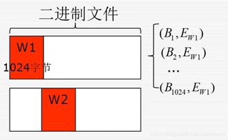
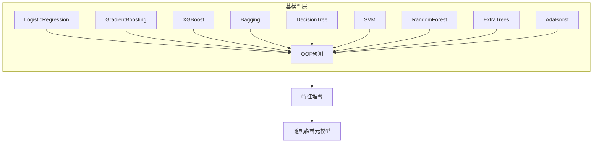
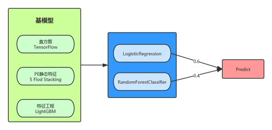
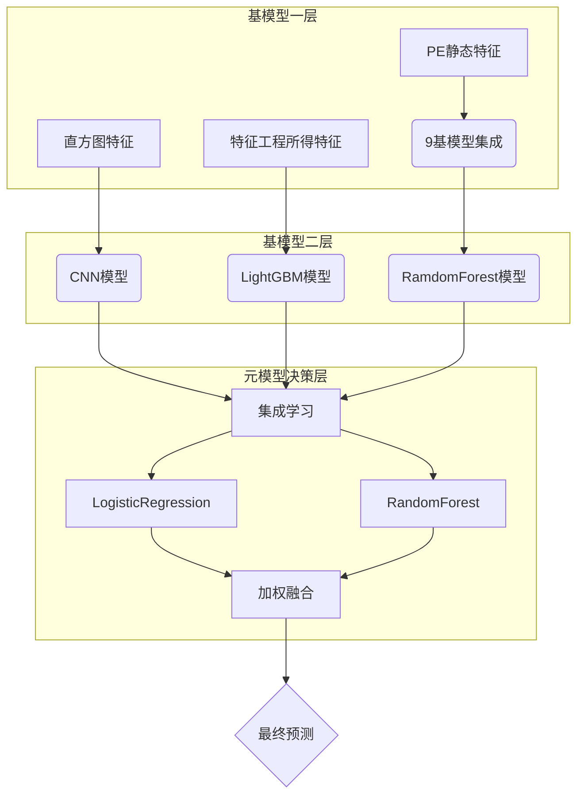

## 特征详解

### 0x10 直方图特征

融合字节直方图（256维）和字节熵直方图（256维），最终生成512维复合特征向量，特征值以ASCII明文存储（每行一个浮点数，并且归一化了）

```python
# normalization
Histogram = np.array(Histogram) / file_size
Byte_Entropy = np.array(Byte_Entropy) / Sum

# 特征融合（512维复合特征）
feature = np.concatenate((Histogram, Byte_Entropy), axis=-1)
feature = list(feature)
```

- 256维：全局字节分布特征 （检测加密/填充数据）
- 256维：局部熵值变化特征 （识别代码段/混淆区域）
- 两者结合可提升对高级恶意软件（如多态病毒、内存驻留木马）的检测能力


#### 0x11 字节直方图（ByteHistogram）

计算每个字节值（0-255）的出现次数

特征维度 ：输出 256 维的特征向量（每个维度对应一个字节值的出现概率）
该特征常用于检测：

- 加密/压缩的代码段（会出现均匀分布的字节值）
- 包含大量空字节（0x00）的可执行文件
- 特定字节模式（如 shellcode 的常见操作码）


```python
Histogram = ByteHistogram().raw_features(data, None)
print(len(Histogram))
print(Histogram)
```

```python
256
[507704, 5296, 4740, 3584, 5303, 3777, 3649, 4018, 6030, 5502, 2758, 3537, 4121, 3101, 2769, 5633, 7907, 2744, 2868, 2483, 3030, 3017, 2817, 2672, 3681, 2627, 2707, 2822, 3046, 2654, 5551, 2782, 4193, 2526, 2548, 2799, 4394, 2515, 2562, 2690, 3215, 2702, 2546, 3187, 2875, 2875, 2694, 2645, 3414, 3083, 3198, 4213, 3571, 3126, 3331, 3237, 3615, 3172, 3280, 3565, 3391, 3925, 3471, 3777, 3343, 3123, 2653, 2595, 3730, 5118, 3335, 2913, 3331, 3032, 2579, 2591, 3213, 4105, 2996, 2679, 3807, 3124, 2628, 3160, 3137, 3850, 3442, 3199, 2908, 3049, 2649, 2730, 3058, 3381, 2974, 2848, 3149, 2966, 2758, 2708, 3203, 3389, 3740, 2732, 3292, 2803, 3279, 2569, 2871, 2963, 2951, 3186, 3076, 2516, 3214, 3075, 4608, 4505, 2933, 2900, 3199, 2802, 2772, 2587, 2979, 2812, 2720, 2844, 3441, 3244, 3079, 5160, 3384, 4334, 2678, 2618, 2989, 5220, 2995, 9857, 2639, 4074, 2636, 2476, 2934, 2592, 2459, 2625, 2775, 2846, 2843, 2504, 2976, 2621, 2568, 2556, 2790, 2683, 2712, 2685, 2707, 2912, 2610, 2733, 2683, 2519, 2624, 2541, 2645, 2536, 2769, 2626, 2839, 2618, 2909, 2534, 3001, 2682, 2555, 2878, 2738, 2478, 3295, 2855, 2966, 2821, 2612, 2544, 2718, 2434, 2691, 2664, 4661, 3743, 3324, 3535, 3374, 2672, 3242, 3502, 3504, 3505, 3083, 2552, 4707, 2471, 2752, 2705, 3141, 2607, 2808, 2576, 2757, 2477, 2758, 2580, 3056, 2763, 2547, 2654, 2845, 2712, 2619, 2853, 3413, 2925, 2524, 2699, 3184, 2755, 2590, 2698, 5530, 2992, 2714, 3454, 3668, 2588, 2495, 3075, 3456, 2892, 2722, 2540, 3145, 2472, 3009, 2916, 3566, 3146, 2506, 2671, 4150, 3105, 3393, 10994]
```

#### 0x12 字节熵直方图（Byte_Entropy）

* 滑动一个1024字节的窗口，步长为256字节
* 计算每个1024字节窗口的熵
* 统计滑动窗口的（字节，熵值）对，最后转换成1x256维的特征向量



双维度特征：

X轴（字节值）：将256种字节值压缩为16个bin（每个bin对应16个连续字节值）
Y轴（局部熵）：计算每个窗口的熵值并量化为16个等级

滑动窗口机制：

window=2048  # 分析窗口大小（2KB）

step=1024    # 滑动步长（1KB）产生50%重叠

这种50%重叠的窗口设计可以捕捉更细粒度的局部特征

熵值计算优化：

使用右移运算 >> 4 将字节值从256维压缩到16维，降低计算复杂度
添加 1e-10 避免零概率导致的数学错误
熵值乘以2补偿信息损失（从8bit熵空间压缩到4bit）


该特征可有效识别：

- 加密/压缩内容 ：表现出高熵且字节值分布均匀
- Shellcode注入 ：特定字节模式与异常熵值组合
- 代码混淆 ：异常高的熵值分布模式
- 空洞攻击（Hollowing） ：局部熵值突变现象

性能优化亮点

```python
# 使用内存视图而非复制数据（stride技巧）
np.lib.stride_tricks.sliding_window_view()
```

此方法通过改变数组步长实现窗口视图，避免实际数据复制，显著降低内存消耗


```python
Byte_Entropy = ByteEntropyHistogram().raw_features(data, None)
print(len(Byte_Entropy))
print(Byte_Entropy)
```

```python
256
[897024, 0, 0, 0, 0, 0, 0, 0, 0, 0, 0, 0, 0, 0, 0, 0, 5842, 19, 19, 24, 23, 24, 22, 19, 13, 13, 22, 18, 33, 13, 23, 17, 1938, 5, 7, 14, 11, 4, 7, 6, 4, 6, 10, 5, 12, 5, 9, 5, 0, 0, 0, 0, 0, 0, 0, 0, 0, 0, 0, 0, 0, 0, 0, 0, 1784, 19, 62, 12, 15, 21, 16, 12, 25, 9, 20, 14, 9, 14, 10, 6, 6508, 445, 176, 84, 59, 55, 63, 92, 207, 57, 106, 71, 52, 66, 97, 54, 9509, 293, 403, 267, 201, 187, 218, 120, 112, 114, 128, 134, 188, 140, 130, 144, 14774, 590, 1259, 341, 327, 245, 260, 334, 330, 278, 337, 374, 264, 260, 254, 253, 1318, 39, 21, 34, 25, 24, 38, 151, 235, 23, 21, 23, 23, 23, 18, 32, 0, 0, 0, 0, 0, 0, 0, 0, 0, 0, 0, 0, 0, 0, 0, 0, 14069, 3241, 857, 4711, 944, 733, 883, 1322, 1820, 596, 624, 706, 676, 713, 746, 2175, 23512, 5405, 2014, 11002, 2325, 2101, 2181, 1839, 2053, 1338, 1383, 1399, 1530, 1421, 1523, 2462, 16143, 4850, 1411, 1710, 1578, 1223, 1404, 1549, 2081, 1420, 1340, 1388, 1456, 1147, 1019, 1241, 10122, 2271, 1393, 2342, 2658, 1187, 1163, 1702, 4927, 1019, 800, 1549, 4114, 1344, 2573, 3844, 25675, 5876, 5680, 5949, 7734, 7000, 9536, 7873, 11363, 3367, 3521, 4401, 7702, 4477, 6673, 10149, 113072, 83674, 80581, 83743, 86676, 87035, 81252, 83991, 98443, 78042, 77240, 77740, 90563, 77839, 85505, 92908]
```


### 0x20 PE静态特征

[EMBER][3]数据集提到的PE文件静态特征提取方法

原始方法提取了许多PE文件静态特征，如下：

- [x] ByteHistogram、ByteEntropyHistogram：直方图
- [x] GeneralFileInfo：调试信息、TLS段、重定位信息……
- [x] HeaderFileInfo：PE头基本所有信息
- [x] ExportsInfo：导出表个数、名称
- [x] SectionInfo：Section名、大小、熵、属性等……
- [ ] ImportsInfo：导入表被破坏，无法解析导入函数信息
- [ ] StringExtractor：字符串提取在特征工程里做，这里删掉一是为了节省时间，二是防止特征重叠

典型应用场景，该组合特征常用于检测

- 加壳程序 （异常节区数量 + 高熵值区域）
- 注入攻击 （非常规导出表 + 可疑节区属性）
- 挖矿软件 （特定API调用模式 + 资源节区异常）


特征维度：256+256+10+62+128+255 = 967维

```python
features = [
        ByteHistogram(), ByteEntropyHistogram(), GeneralFileInfo(),
        HeaderFileInfo(), ExportsInfo(), SectionInfo()
    ] # ImportsInfo(), StringExtractor()
print(features)
```

```python
[histogram(256), byteentropy(256), general(10), header(62), exports(128), section(255)]
```


```
[run.py主流程]
   │
   ├─ 初始化PEFeatureExtractor
   │   (pe = PEFeatureExtractor())
   │
   └─ 多进程特征提取池
       ├─ 遍历样本路径
       │   (test_fixed_path)
       │   │
       │   └─ 调用get_pe_raw_vector
       │       ├─ 读取样本字节
       │       ├─ 执行pe.feature_vector()
       │       └─ 存储到共享列表
       │
       └─ 结果序列化
           (pickle.dump)
```

LIEF（Library to Instrument Executable Formats） 是一个跨平台的二进制文件解析库，支持PE/ELF/Mach-O等格式。

```python
try:
    # 使用LIEF库解析PE文件
    lief_binary = lief.PE.parse(list(bytez))
except (lief.bad_format, lief.bad_file, lief.pe_error, lief.parser_error, RuntimeError) as e:
    print("lief error: ", str(e))
    lief_binary = None  # 解析失败时设为None
except Exception:  # 其他异常直接抛出
    raise
```

异常处理逻辑 ：

- 处理损坏PE文件（如加壳样本）
- 跳过无法解析的文件（返回空特征）

作用：

- 检测节区属性异常（如可写可执行节区）
- 识别非常规导入函数（如无Kernel32导入）
- 分析资源段内容（如隐藏的恶意脚本）


LIEF分析结果示例：

```python
fp = '../tmp/00a8b0ff6c1a48a69f85657e57d9ed99'
with open(fp, 'rb') as f:
    bytez = f.read()

lief_binary = lief.PE.parse(list(bytez))
print(lief_binary)
```

```python
Dos Header
==========
Magic:                        5a4d
Used Bytes In The LastPage:   90
File Size In Pages:           3
Number Of Relocation:         0
Header Size In Paragraphs:    4
...
OEM info:                     0
Address Of New Exe Header:    130

Rich Header
===========
Key: f6401d48
  - ID: 0x1020 Build ID: 0x64eb Count: 1
  - ID: 0x1000 Build ID: 0x64eb Count: 1
  - ID: 0x1040 Build ID: 0x64eb Count: 5
            ...
  - ID: 0xf100 Build ID: 0x9cb4 Count: 19
  - ID: 0x0000 Build ID: 0x0000 Count: 0

Header
======
Signature:                    50 45 0 0 
Machine:                      I386
Number Of Sections:           4
...
Time Date Stamp:              5a451f1f

Optional Header
===============
Magic:                           10b
Major Linker Version:            d
Minor Linker Version:            19
Size Of Code:                    7ac00
...
Loader Flags:                    0
Number Of RVA And Size:          10

Data directories
================
Data directory "EXPORT_TABLE"
RVA: 0x   97090
Size: 0x  4c
Section:  .rdata
    
Data directory "IMPORT_TABLE"
RVA: 0x   0
Size: 0x  0

...

Data directory "CLR_RUNTIME_HEADER"
RVA: 0x   0
Size: 0x  0

Sections
========
.text     7abca     1000      7ac00     400       0         7.8773    CNT_CODE - MEM_EXECUTE - MEM_READ
.rdata    1cdf2     7c000     1ce00     7b000     0         7.35952   CNT_INITIALIZED_DATA - MEM_READ
.data     a6c60     99000     a5000     97e00     0         3.29984   CNT_INITIALIZED_DATA - MEM_READ - MEM_WRITE
.reloc    5778      140000    5800      13ce00    0         5.65389   CNT_INITIALIZED_DATA - MEM_DISCARDABLE - MEM_READ

TLS
===
Address Of Index:                       1e49e52c
Address Of Callbacks:                   1e3dc5e8
Virtual Address of RawData (start):     1e3f248c
Virtual Address of RawData (end):       1e3f2494
Size Of Zero Fill:                      0
Associated section:                     .rdata
    
Debug
=====
Characteristics:    8a84c6d4
Timestamp:          82c6e175
Major version:      ae33
...

Relocations
===========
1000      e0        
    - HIGHLOW   a     
    - HIGHLOW   f     
    - HIGHLOW   18    
    - HIGHLOW   1e 
    ...
2000      98        
    - HIGHLOW   1b    
    - ABSOLUTE  0     
    - HIGHLOW   7a  
    ...
...
13b000    34        
    - ABSOLUTE  0     
    - ABSOLUTE  0     
    - ABSOLUTE  0     
    - HIGHLOW   30

Export
======
m64j___hw.dll
  DllInstall             1    5ef0      


Symbols
=======

Load Configuration
==================
Version:                                     UNKNOWN
Characteristics:                             0xa0
Timedatestamp:                               0
Major version:                               0
...
Edit list:                                   0
Security cookie:                             0x1e48a5e8
```


这五部分特征，除了字节直方图和字节熵直方图外（这俩可以直接算），其余均是根据LIEF分析结果来处理的。

```python
features = [ # 集成了5个对象
    ByteHistogram(), ByteEntropyHistogram(), GeneralFileInfo(),
    HeaderFileInfo(), ExportsInfo(), SectionInfo()
]
```

以section特征为例

展示`SectionInfo`对象的定义

```python
class SectionInfo():
    name = 'section'
    dim = 255 # 特征维度
    # 用做处理lief分析结果
    def raw_features(self, bytez, lief_binary):
        ...
    # 进一步处理，标准化、结构化结果
    def process_raw_features(self, raw_obj):
        ...
    ...
```

lief处理结果输出看看

```python
fe = features[5]
print(len(fe.raw_features(bytez, lief_binary)))
print({fe.name: fe.raw_features(bytez, lief_binary)})
```

```python
{
    'section': {
        'entry': '.text', 
        'sections': [
            {'name': '.text', 'size': 502784, 'entropy': 7.8772955321013445, 'vsize': 502730, 'props': ['CNT_CODE', 'MEM_EXECUTE', 'MEM_READ']}, 
            {'name': '.rdata', 'size': 118272, 'entropy': 7.359519722739576, 'vsize': 118258, 'props': ['CNT_INITIALIZED_DATA', 'MEM_READ']}, 
            {'name': '.data', 'size': 675840, 'entropy': 3.2998353275291605, 'vsize': 683104, 'props': ['CNT_INITIALIZED_DATA', 'MEM_READ', 'MEM_WRITE']}, 
            {'name': '.reloc', 'size': 22528, 'entropy': 5.653888730136691, 'vsize': 22392, 'props': ['CNT_INITIALIZED_DATA', 'MEM_DISCARDABLE', 'MEM_READ']}
        ]
    }
}
```

进一步处理数据，使其结构化

```python
fe = features[5]
raw_obj = {fe.name: fe.raw_features(bytez, lief_binary)}

print(len(raw_obj[fe.name]))
print(raw_obj[fe.name])
print(len(fe.process_raw_features(raw_obj[fe.name])))
print(fe.process_raw_features(raw_obj[fe.name])) # normalization
```

```python
2
{'entry': '.text', 
 'sections': [
     {'name': '.text', 'size': 502784, 'entropy': 7.8772955321013445, 'vsize': 502730, 'props': ['CNT_CODE', 'MEM_EXECUTE', 'MEM_READ']}, 
     {'name': '.rdata', 'size': 118272, 'entropy': 7.359519722739576, 'vsize': 118258, 'props': ['CNT_INITIALIZED_DATA', 'MEM_READ']}, 
     {'name': '.data', 'size': 675840, 'entropy': 3.2998353275291605, 'vsize': 683104, 'props': ['CNT_INITIALIZED_DATA', 'MEM_READ', 'MEM_WRITE']}, 
     {'name': '.reloc', 'size': 22528, 'entropy': 5.653888730136691, 'vsize': 22392, 'props': ['CNT_INITIALIZED_DATA', 'MEM_DISCARDABLE', 'MEM_READ']}
 ]}
```

```python
255
[ 4.0000000e+00  0.0000000e+00  0.0000000e+00  1.0000000e+00
  1.0000000e+00  0.0000000e+00  0.0000000e+00  0.0000000e+00
  0.0000000e+00  0.0000000e+00 -2.2528000e+04  0.0000000e+00
  0.0000000e+00  0.0000000e+00  0.0000000e+00  0.0000000e+00
  0.0000000e+00  0.0000000e+00  0.0000000e+00  1.1827200e+05
  0.0000000e+00  0.0000000e+00  0.0000000e+00  0.0000000e+00
  ...
  0.0000000e+00  1.0000000e+00  0.0000000e+00  0.0000000e+00
  0.0000000e+00  0.0000000e+00  0.0000000e+00  0.0000000e+00
  0.0000000e+00  0.0000000e+00  0.0000000e+00  0.0000000e+00
  0.0000000e+00  0.0000000e+00  0.0000000e+00  0.0000000e+00
  0.0000000e+00  0.0000000e+00  0.0000000e+00  0.0000000e+00
  0.0000000e+00  0.0000000e+00  0.0000000e+00]
```


`process_raw_features`函数的核心部分：

- 怎么做到能够将非量化的数据转化为量化数据的？

- 通过特征哈希（FeatureHasher）技术将非结构化数据转换为固定维度的数值向量

处理LIEF分析结果后，得到的原始数据包括entry节名称和各个section的name、size、entropy、vsize、props等。这些数据中有字符串和类别型数据，比如name和props，这些非数值型数据需要转换为数值特征

```python
from sklearn.feature_extraction import FeatureHasher
```

```python
fe = features[5]
raw_obj = {fe.name: fe.raw_features(bytez, lief_binary)}[fe.name]
print(raw_obj)
```

```python
{'entry': '.text', 
 'sections': [
     {'name': '.text', 'size': 502784, 'entropy': 7.8772955321013445, 'vsize': 502730, 'props': ['CNT_CODE', 'MEM_EXECUTE', 'MEM_READ']}, 
     {'name': '.rdata', 'size': 118272, 'entropy': 7.359519722739576, 'vsize': 118258, 'props': ['CNT_INITIALIZED_DATA', 'MEM_READ']}, 
     {'name': '.data', 'size': 675840, 'entropy': 3.2998353275291605, 'vsize': 683104, 'props': ['CNT_INITIALIZED_DATA', 'MEM_READ', 'MEM_WRITE']}, 
     {'name': '.reloc', 'size': 22528, 'entropy': 5.653888730136691, 'vsize': 22392, 'props': ['CNT_INITIALIZED_DATA', 'MEM_DISCARDABLE', 'MEM_READ']}
 ]}
```

```python
sections = raw_obj['sections']

# 第一部分：基础统计特征（5维）
general = [
    len(sections),                     # 总节区数量
    sum(1 for s in sections if s['size'] == 0),  # 空尺寸节区数量
    sum(1 for s in sections if s['name'] == ""),  # 无名节区数量 
    sum(1 for s in sections if 'MEM_READ' in s['props'] and 'MEM_EXECUTE' in s['props']),  # 可读可执行节区
    sum(1 for s in sections if 'MEM_WRITE' in s['props'])  # 可写节区
]
print(general)
```

```python
[4, 0, 0, 1, 1]
```

```python
# 第二部分：哈希技巧转换（每个FeatureHasher生成50维）
# 节区尺寸哈希（名称+尺寸）
section_sizes = [(s['name'], s['size']) for s in sections]
section_sizes_hashed = FeatureHasher(50, input_type="pair").transform([section_sizes]).toarray()[0]
print(section_sizes)
print(section_sizes_hashed)
```

```python
[('.text', 502784), ('.rdata', 118272), ('.data', 675840), ('.reloc', 22528)]
[      0.       0.       0.       0.       0.  -22528.       0.       0.
       0.       0.       0.       0.       0.       0.  118272.       0.
       0.       0.       0.       0.       0.       0.       0.       0.
       0.       0.       0.       0.       0.       0.       0.       0.
 -675840.       0.       0.       0.       0.       0.       0.       0.
       0. -502784.       0.       0.       0.       0.       0.       0.
       0.       0.]
```

`FeatureHasher`解析：

```python
section_sizes_hashed = FeatureHasher(50, input_type="pair").transform([section_sizes]).toarray()[0]
```

- **参数解释**：

  - `n_features=50`：输出向量的维度为 50。
  - `input_type="pair"`：输入是键值对列表。

- **内部过程**：

  1. **哈希键名**：对每个键（如 `.text`）计算两次哈希：
     - 第一次确定索引位置（`hash(key) % 50`）。
     - 第二次确定符号（`1` 或 `-1`，通过奇偶性判断）。
  2. **累加值**：将值乘以符号后累加到对应索引位置。

  ```python
  # 原始数据（假设）
  sections = [('.text', 1024), ('.data', 2048), ('.text', 4096)]
  
  # 经过哈希函数映射（示意）
  hash('.text') % 50 → 12
  hash('.data') % 50 → 35
  
  # 特征向量生成（伪代码）
  feature_vector[12] += 1024 + 4096 = 5120
  feature_vector[35] += 2048 = 2048
  ```

- **负值的来源**：
  - 键 `.text` 被哈希到索引 `40`，且符号为 `-1`，因此 `502784 * -1 = -502784`。
  - 类似地，`.rdata` 的符号为 `+1`，哈希到索引 `14`，因此值为 `118272`。
- **稀疏性**：
  
  - 大部分位置为 `0`，因为只有 4 个键值对参与哈希。

符号对哈希冲突的影响：

1. **哈希冲突**：
   - 不同键可能映射到同一索引（例如 `.text` 和 `.data` 哈希到同一位置），但通过符号随机性可以部分抵消冲突的影响。
   - 冲突概率与 `n_features` 相关，维度越大冲突越少。
2. **符号的作用**：
   - 例如，假设两个冲突的键值对 `('A', 100)` 和 `('B', 200)`，若符号分别为 `+1` 和 `-1`，则累加结果为 `100 - 200 = -100`，冲突带来的误差小于直接相加 `100 + 200 = 300`。

使用特征哈希的原因：

- **非结构化数据的处理**：特征哈希天然支持键值对、字符串、分类变量等非结构化数据，解决类别型数据（如节区名称）的编码问题，同时保留名称与数值的关联关系（通过` input_type="pair" `），无需预先构建词表。
- **内存友好**：避免存储庞大的词表。
- **在线学习**：动态处理新特征（例如新出现的段名 `.new_section`）。
- **维度可控**：输出维度固定，将不定长的节区信息压缩为固定维度，适合机器学习模型输入。

这个例子中的映射结果：

| 键名     | 原始值 | 哈希位置 | 符号 | 贡献值  |
| :------- | :----- | :------- | :--- | :------ |
| `.text`  | 502784 | 40       | -1   | -502784 |
| `.rdata` | 118272 | 14       | +1   | +118272 |
| `.data`  | 675840 | 32       | -1   | -675840 |
| `.reloc` | 22528  | 5        | -1   | -22528  |

最终向量中只有索引 `5, 14, 32, 40` 处有非零值，其余为 0。

通过这种技术，即使是非结构化的键值对数据（如二进制文件的段信息），也能被高效地转换为固定维度的数值向量，供机器学习模型直接使用。

同理可得：

```python
# 节区熵值哈希（名称+熵）
section_entropy = [(s['name'], s['entropy']) for s in sections]
section_entropy_hashed = FeatureHasher(50, input_type="pair").transform([section_entropy]).toarray()[0]
print(section_entropy)
print(section_entropy_hashed)
```

```python
[('.text', 7.8772955321013445), ('.rdata', 7.359519722739576), ('.data', 3.2998353275291605), ('.reloc', 5.653888730136691)]
[ 0.          0.          0.          0.          0.         -5.65388873
  0.          0.          0.          0.          0.          0.
  0.          0.          7.35951972  0.          0.          0.
  0.          0.          0.          0.          0.          0.
  0.          0.          0.          0.          0.          0.
  0.          0.         -3.29983533  0.          0.          0.
  0.          0.          0.          0.          0.         -7.87729553
  0.          0.          0.          0.          0.          0.
  0.          0.        ]
```

```python
# 节区虚拟大小哈希（名称+虚拟大小）
section_vsize = [(s['name'], s['vsize']) for s in sections]
section_vsize_hashed = FeatureHasher(50, input_type="pair").transform([section_vsize]).toarray()[0]
```

```python
[('.text', 502730), ('.rdata', 118258), ('.data', 683104), ('.reloc', 22392)]
[      0.       0.       0.       0.       0.  -22392.       0.       0.
       0.       0.       0.       0.       0.       0.  118258.       0.
       0.       0.       0.       0.       0.       0.       0.       0.
       0.       0.       0.       0.       0.       0.       0.       0.
 -683104.       0.       0.       0.       0.       0.       0.       0.
       0. -502730.       0.       0.       0.       0.       0.       0.
       0.       0.]
```

```python
# 入口节名称哈希
entry_name_hashed = FeatureHasher(50, input_type="string").transform([raw_obj['entry']]).toarray()[0]
print(raw_obj['entry'])
print(entry_name_hashed)
```

```python
.text
[ 0.  0.  0. -1.  0.  0.  0.  0.  0.  1.  0.  0.  0.  0.  0.  0.  0.  0.
  0.  0.  0.  0.  0.  0.  0.  0.  0.  0.  0.  0.  0.  0.  0.  0.  0.  0.
  0.  0.  0. -2.  0.  0.  0.  1.  0.  0.  0.  0.  0.  0.]
```

```python
# 入口节属性哈希
characteristics = [p for s in sections for p in s['props'] if s['name'] == raw_obj['entry']]
characteristics_hashed = FeatureHasher(50, input_type="string").transform([characteristics]).toarray()[0]
print(characteristics)
print(characteristics_hashed)
```

```python
['CNT_CODE', 'MEM_EXECUTE', 'MEM_READ']
[ 0.  0.  0.  0.  0.  0.  0.  0.  0.  0.  0.  0.  0. -1.  0.  0.  0.  0.
  0.  0.  0.  0.  0.  1.  0.  0.  0.  0.  1.  0.  0.  0.  0.  0.  0.  0.
  0.  0.  0.  0.  0.  0.  0.  0.  0.  0.  0.  0.  0.  0.]
```

```python
# 第三部分：特征拼接（5 + 50*5 = 255维）
return np.hstack([
    general,                     # 5
    section_sizes_hashed,       # 50
    section_entropy_hashed,     # 50
    section_vsize_hashed,       # 50
    entry_name_hashed,          # 50
    characteristics_hashed     # 50
]).astype(np.float32)
```


### 0x30 特征工程

主要包括五部分，分别为：Section信息、字符匹配、Yara匹配、Opcode和其他布尔信息


```python
def get_feature_engineering(self, sample_data):
    # 阶段1：节区信息特征（16个基础特征）
    tmp_section = self.get_section_infomation(sample_data)  # 获取节区基本信息
    ...
    # 阶段2：字符串模式匹配（26个特征）
    tmp_match = self.string_match(sample_data)  # 匹配钱包地址、路径、URL等模式
    # 阶段3：YARA规则检测（2个特征）
    tmp_yara = self.yara_match(sample_data)  # 检测加壳和通用恶意规则
    # 阶段4：关键字扫描（5个特征）
    tmp_count = self.string_count(sample_data)  # 统计AV/调试工具/矿池等关键词
    # 阶段5：操作码分析（7个统计特征）
    tmp_opcode = self.opcodes(sample_data)  # 提取函数操作码序列特征
    # 特征融合（共16+26+2+5+7=56维）
    res_dict = ChainMap(tmp_section, tmp_match, tmp_yara, tmp_count, tmp_opcode)
    res = [res_dict[key] for key in self.keys]
    return res
```


* 关键方法调用关系

```plaintext
get_feature_engineering
├─ get_section_infomation → 节区属性分析（LIEF解析）
├─ string_match → 正则模式匹配（钱包/URL/路径等）
├─ yara_match → 恶意规则检测
├─ string_count → 关键字扫描
└─ opcodes → 反汇编特征提取
```

* 典型特征示例

1. entr_X_weight （可执行节熵值占比）：
   
   - 正常样本：0.15-0.25（代码节中等熵值）
   - 恶意样本：>0.3（加壳/加密代码的高熵特征）
2. pool_name_count （矿池关键词）：
   
   - 挖矿软件：≥3个常见矿池名称
   - 正常软件：0-1个偶然匹配
3. opcode_uniq （唯一操作码数量）：
   
   - 勒索软件：200+（复杂逻辑）
   - 下载器：50-100（简单循环结构）


例子

```python
from feature_engineering import Feature_engineering
fn = Feature_engineering()

fp = test_fixed_path[0] # ../tmp/00a8b0ff6c1a48a69f85657e57d9ed99
with open(fp, 'rb') as f:
    sample_data = f.read()
```

```python
tmp_section = fn.get_section_infomation(sample_data)
section_keys = ["size_R", "size_W", "size_X", "entr_R", "entr_W", "entr_X"]
for k in section_keys:
    file_size = tmp_section['file_size']
    tmp = tmp_section[k]
    tmp_section["{}_weight".format(k)] = tmp / file_size
print(len(tmp_section))
print(tmp_section)
```

```python
16
{'entry': 5, 'size_R': 329856.0, 'size_W': 675840.0, 'size_X': 502784.0, 'entr_R': 6.047634828126693, 'entr_W': 3.2998353275291605, 'entr_X': 7.8772955321013445, 'rsrc_num': 0, 'section_num': 4, 'file_size': 1320448, 'size_R_weight': 0.24980612640558356, 'size_W_weight': 0.5118262892594029, 'size_X_weight': 0.3807677394338891, 'entr_R_weight': 4.579987116589743e-06, 'entr_W_weight': 2.499027093478244e-06, 'entr_X_weight': 5.96562343394162e-06}
```

```python
tmp_match = fn.string_match(sample_data)
print(len(tmp_match))
print(tmp_match)
```

```python
26
{'btc_count': 0, 'btc_mean': 0, 'ltc_count': 1, 'ltc_mean': 26.0, 'xmr_count': 0, 'xmr_mean': 0, 'paths_count': 2, 'paths_mean': 4.0, 'regs_count': 1, 'regs_mean': 3.0, 'urls_count': 0, 'urls_mean': 0, 'ips_count': 1, 'ips_mean': 7.0, 'mz_count': 11, 'mz_mean': 2.0, 'pe_count': 19, 'pe_mean': 2.0, 'pool_count': 7, 'pool_mean': 4.0, 'cpu_count': 10, 'cpu_mean': 3.0, 'gpu_count': 0, 'gpu_mean': 0, 'coin_count': 0, 'coin_mean': 0}
```

```python
tmp_yara = fn.yara_match(sample_data)
print(len(tmp_yara))
print(tmp_yara)
```

```python
2
{'packer_count': 1, 'yargen_count': 1}
```

```python
tmp_count = fn.string_count(sample_data)
print(len(tmp_count))
print(tmp_count)
```

```python
5
{'av_count': 9, 'dbg_count': 0, 'pool_name_count': 14, 'algorithm_name_count': 2, 'coin_name_count': 7}
```

```python
tmp_opcode = fn.opcodes(sample_data)
print(len(tmp_opcode))
print(tmp_opcode)
```

```python
7
{'opcode_min': 3, 'opcode_max': 950, 'opcode_sum': 17497, 'opcode_mean': 52.86102719033233, 'opcode_var': 5681.738994715272, 'opcode_count': 331, 'opcode_uniq': 179}
```


#### 0x31 Section信息

节区特征是PE文件一种重要特征，过多的节区、异常的节区名、异常的资源节区个数等指标都可以指示这个PE文件的可疑程度，因此我们首先针对节区进行特征统计：

* OEP所在节区名长度
  * OEP所在节区名一般为`.text`，如果过长或过短说明很可能被混淆
  * 比如UPX壳OEP处节区名为`UPX1`。
* 各可读、可写、可执行节区大小和熵，和各属性节区占文件大小比例
  * 举例：如果可执行节区占比过小，很可能加壳了（压缩壳）
* 资源节区个数
  * 资源节区一般藏又一些压缩数据，比如挖矿恶意载荷
* 节区总个数
  * 恶意软件节区数一般比较多

```Python
# OEP处section名长度
section_info["entry"] = len(entry_section)
section_info["section_num"] = len(lief_binary.sections)
# 可读、可写、可执行sections大小均值
sR, sW, sX = [], [], []
# 可读、可写、可执行sections熵值均值
entrR, entrW, entrX = [], [], []
# 资源section个数
rsrc_num = 0
for s in lief_binary.sections:
    props = [str(c).split('.')[-1] for c in s.characteristics_lists]
    if "MEM_READ" in props:
        sR.append(s.size)
        entrR.append(s.entropy)
    if "MEM_WRITE" in props:
        sW.append(s.size)
        entrW.append(s.entropy)
    if "MEM_EXECUTE" in props:
        sX.append(s.size)
        entrX.append(s.entropy)
    if 'rsrc' in s.name:
        rsrc_num += 1
section_info['size_R'], section_info['size_W'], section_info['size_X'] = np.mean(sR), np.mean(sW), np.mean(sX)
section_info['entr_R'], section_info['entr_W'], section_info['entr_X'] = np.mean(entrR), np.mean(entrW), np.mean(entrX)
section_info['rsrc_num'] = rsrc_num
```


#### 0x32 字符匹配

根据资格赛获得的启发，队员们手写相应的正则匹配模式，其中包括

* 路径、注册表、URL、IP地址正则匹配
  * 其中因为注册表正则模式存在回溯问题，有的样本存在特别长的字符串，导致一个样本可能匹配了八分钟，所以我们复赛简单粗暴改成匹配字符串”reg”。主要原因是我们认为操作注册表必然存在相应函数，而这些函数名基本含有”reg”。
* 比特币钱包地址正则匹配
  * 主要写了三种货币：比特币、莱特币、门罗币
* 一些重要字符串匹配
  * ”MZ”、”PE”指示可能含别的PE文件
  * ”pool”、”cpu”、”gpu”、”coin”则是我们认为挖矿软件普遍存在的字符串

```Python
self.path_pattern = re.compile(b'[C-Zc-z]:(?:(?:\\\\|/)[^\\\\/:*?"<>|"\x00-\x19\x7f-\xff]+)+(?:\\\\|/)?')
self.regs_pattern = re.compile(b'reg', re.IGNORECASE)# re.compile(b'[A-Z_ ]{5,}(?:\\\\[a-zA-Z ]+)+')
self.urls_pattern = re.compile(b'https?://(?:[-\w.]|(?:%[\da-fA-F]{2}))+')
# self.strings_pattern = re.compile(b'[\x20-\x7f]{5,}')
self.ip_pattern = re.compile(b'(?:(?:25[0-5]|2[0-4]\d|[01]?\d{1,2})\.){3}(?:25[0-5]|2[0-4]\d|[01]?\d{1,2})')
​
# #比特币钱包地址
self.wallet_pattern_btc = re.compile(b'(?:1|3|bc1|bitcoincash:q)(?:(?![0OIi])[0-9A-Za-z]){25,34}')
self.wallet_pattern_ltc = re.compile(b'(?:ltc1|M|L)[A-Za-z0-9]{25,36}')
self.wallet_pattern_xmr = re.compile(b'[0-9A-Za-z]{90,100}') #门罗币
​
self.mz_pattern = re.compile(b'MZ')
self.pe_pattern = re.compile(b'PE')
self.pool_pattern = re.compile(b'pool', re.IGNORECASE)
self.cpu_pattern = re.compile(b'cpu', re.IGNORECASE)
self.gpu_pattern = re.compile(b'gpu', re.IGNORECASE)
self.coin_pattern = re.compile(b'coin', re.IGNORECASE)
```


#### 0x33 Yara匹配

Yara规则是基于二进制文件中包含的文本或二进制字符串的描述创建的。我们首先使用[Yara-Rules][4]提供的规则进行匹配，其中包括：

* [壳规则](rules/packer.yar)

  * 包含许多已知壳的Yara匹配规则

* [密码学常量规则](rules/crypto_signatures.yar)

  * 特别是哈希算法初始值
  * 匹配时间略长，复赛忍痛舍弃

最后我们还使用了[yarGen][5]工具，提取**训练集黑样本**特征，其原理是先解析出样本集中的共同的字符串，然后经过白名单库的过滤，最后通过启发式、机器学习等方式筛选出最优的Yara规则。根据得到的Yara规则集结果，选择匹配度大于某一阈值的规则形成新的规则集，查看匹配黑白样本的分布比例，筛选部分白样本规则。通过不断的调整阈值参数与筛除比例，在尽可能泛化的同时匹配到更多的黑样本，最后人工结合挖矿特征筛选出更值得关注的部分，优化规则集。

最终得到的[自定义Yara规则集](rules/rule20.yar)阈值为20，即每条规则在**训练集黑样本**中匹配样本个数大于等于20。


#### 0x34 Opcode

通过传统逆向工具解析PE文件中的函数实在太耗时，因此我们打算通过简单的正则搜索识别代码中的函数，然后提取函数片段中的Opcode并保存。例如x86下，按栈匹配`push ebp; mov ebp, esp; ……; ret`如下代码段。

```Python
self.m32_pat = re.compile(b'\x55\x8b\xec[^\xc3]*\xc3')
# …………
all_functions = self.m32_pat.findall(binary)
for function in all_functions:
    function_op = []
    for _, _, mnemonic, _ in self.md32.disasm_lite(function, 0x0):
        try:
            function_op.append(self.opcode_dict[mnemonic])
        except Exception:
            break
    else:
        op_pattern.append(function_op)
```

原因是发现在挖矿样本中有大量样本间共有的opcode特征，而白样本中却不明显。因此可以统计匹配出的函数个数、opcode种类个数、平均值、方差等特征。

#### <span id="head14"> 其他布尔信息</span>

根据资格赛所提供的启发，我们还收集了各种类别的进程名、数字货币名、密码学算法名等信息，并将它们存储在`./data`中，以检测它们是否在给定PE文件内，具体如下表所示。

| 文件名            | 注释                          |
| ----------------- | ----------------------------- |
| algorithm.txt     | 常见密码学算法名              |
| av.json           | [常见的杀毒软件的进程名称][6] |
| coin.txt          | 数字货币名                    |
| dbg.txt           | 调试器名                      |
| domain_suffix.txt | 常见顶级域名（复赛时未使用    |
| OPCODE.txt        | Opcode词汇表                  |
| pool.txt          | [常见矿池二级域名][7]         |
| vm.txt            | 虚拟机内软件名                |

我们搜集了常见的杀毒软件的进程名称，以此作为挖矿软件对杀毒软件的检测行为的特征。

考虑到挖矿软件需要反分析、反调试来保证持久化，我们还以常见的调试器进程名作为挖矿软件的反调试行为的特征，主要为我们日常使用的调试工具。

考虑到挖矿软件会进行反沙箱对抗，我们搭建了各种不同的虚拟机软件环境，整理了挖矿软件可能检测的虚拟机环境特征。
由于挖矿过程必然存在矿池，因此我们想到检测矿池二级域名来作为挖矿软件的一个有效特征，于是编写了爬虫脚本通过正则匹配的方式爬取了目前常用的矿池域名300余条。


### 0x40 模型训练


#### 0x41 直方图特征模型部分

针对直方图特征设计了一个卷积神经网络(CNN)模型，主要架构如下：

复现论文：Deep Neural Network Based Malware Detection Using Two Dimensional

模型架构：

- 输入重塑（32x16）：将512维直方图转为二维矩阵，保留字节/熵值的空间分布特征 

- 小卷积核（2x2）：捕捉局部统计模式，识别异常字节簇（如加密段） 

- 通道数递增（60→200）：逐步提取高阶特征，发现复杂模式（如多态代码特征） 

- 大密度层（500节点）：增强非线性表达能力，处理高度非线性的恶意模式 

- Sigmoid输出：适配二分类任务（恶意/正常），输出恶意概率值

```plaintext
Input(512) → Reshape(32x16) → Conv(60) → Pool → Conv(200) → Pool → Dense(500) → Output(1)
```
```python
# 输入层：接收512维直方图特征
inputs = layers.Input(shape=(LENGTH, 1))  # LENGTH=512

# 特征重塑：将1D特征转换为2D伪图像 (32x16)
re_inputs = tf.reshape(inputs, [-1, WIDTH, HEIGHT, 1])  # WIDTH=32, HEIGHT=16

# 双卷积层设计：捕捉局部统计特征
Conv_1 = layers.Conv2D(60, (2,2), activation='relu')(re_inputs)  # 捕捉字节分布模式
Conv_2 = layers.Conv2D(200, (2,2), activation='relu')(pool_1)     # 提取高阶熵特征

# 池化层
pool_1 = layers.MaxPooling2D()(Conv_1) # 捕捉字节分布模式
pool_2 = layers.MaxPooling2D()(Conv_2) # 提取高阶熵特征
Flat = layers.Flatten()(pool_2)

# 全连接层：特征融合与分类
Dense_1 = layers.Dense(500, activation='relu')(Flat)  # 综合卷积特征
outputs = layers.Dense(1, activation='sigmoid')(Dense_1)  # 二分类输出
```

优化部分：

1. **正则化配置**：

```python
dropout = layers.Dropout(0.2)(Dense_1)  # 20%的神经元丢弃率
```

2. **训练优化：**

```python
# 早停机制（6轮耐心值）
EarlyStopping(monitor='val_loss', patience=6)  

# 动态学习率调整（4轮无改善后降半）
ReduceLROnPlateau(patience=4, factor=0.5)
```

适合检测具有以下行为的样本：

1. 代码加密/混淆 （高熵值区域异常分布）
2. 数据填充攻击 （连续重复字节模式）
3. 内存驻留木马 （特殊字节分布模式）


#### 0x42 PE特征模型部分

通过PE文件的967维结构化特征（节区信息/导入表/字符串等）训练多个基模型

```python
# 训练的9个基模型
models = [
    'lr'    : LogisticRegression,        # 逻辑回归
    'gbc'   : GradientBoostingClassifier, # 梯度提升树
    'bc'    : BaggingClassifier,        # 袋装法集成
    'xgb'   : XGBClassifier,            # XGBoost
    'dt'    : DecisionTreeClassifier,   # 决策树
    'svm'   : LinearSVC,                # 支持向量机
    'rfc'   : RandomForestClassifier,   # 随机森林
    'etc'   : ExtraTreesClassifier,     # 极端随机树
    'ada'   : AdaBoostClassifier        # AdaBoost
]
```


采用二级集成学习架构进行集成：

```plaintext
第一层：9个异构基模型 → 第二层：随机森林元模型（rfc_pe_model）
```

基模型通过5折交叉验证生成OOF预测结果，将OOF处理后的训练集堆叠，再训练随机森林元模型


OOF的作用：

* 对每个折叠，模型仅在 `kf_x_train`（训练集部分）训练，并在 `kf_x_test`（验证集部分）预测，确保预测结果未见过验证集数据。

- 最终 `oof_train` 是完整训练集的OOF预测（每个样本的预测来自未训练该样本的模型），`oof_test` 是测试集的平均预测。

- OOF保证堆叠特征无过拟合风险，因为每个样本的预测来自未见过该样本的模型。


训练随机森林元模型的作用：

将9个基模型的OOF预测结果通过随机森林进一步抽象为单一训练集，作为后续模型的输入。使用 `rfc_pe_model` 对9个经OOF后的训练集进行堆叠和训练，理论上可以捕捉基模型之间的非线性关系。





该方法是集成学习中的一种，名为Stacking（堆叠）：用元模型整合基模型的预测结果。另外还有两种，分别是Bagging和Boosting。Bagging（如随机森林）：并行训练多个基模型，通过投票或平均融合结果。Boosting（如AdaBoost、GBDT）：顺序训练基模型，调整样本权重或模型权重。

基模型与元模型的概念：

1. **基模型**：
   - **角色**：集成学习中的底层模型，直接对原始数据进行学习。
   - **特点**：可以是同质模型（如随机森林中的多个决策树），也可以是异质模型（如同时用SVM、决策树、神经网络）。
   - **目标**：提供多样化的预测视角，减少整体偏差或方差。
2. **元模型**：
   - **角色**：在堆叠法（Stacking）中，用于综合基模型的预测结果。
   - **输入**：基模型的输出（如分类概率、回归值）作为特征。
   - **示例**：逻辑回归、线性回归、甚至另一个复杂的模型（如神经网络）。


加权融合（Weighted Fusion）概念：

**定义**：对不同基模型的预测结果赋予不同权重，通过加权平均或投票得到最终结果。

**应用场景**：

- **回归任务**：加权平均各模型的预测值（如：模型A权重0.7，模型B权重0.3）。
- **分类任务**：加权投票（如模型A的投票权重更高）。
- **动态调整**：根据模型在验证集上的表现分配权重（如准确率高的模型权重大）。

**例子**：
三个基模型的分类概率分别为 [0.8, 0.2]、[0.6, 0.4]、[0.7, 0.3]，权重为 [0.5, 0.3, 0.2]，则加权融合结果为：
`(0.5*0.8 + 0.3*0.6 + 0.2*0.7, 0.5*0.2 + 0.3*0.4 + 0.2*0.3) = (0.74, 0.26)`，最终预测为第一类。


堆叠（Stacking）概念：

**定义**：分层集成方法，基模型的输出作为元模型的输入特征，训练元模型进行最终预测。

**步骤**：

1. **基模型训练**：用训练数据训练多个基模型（如SVM、决策树、KNN）。
2. **生成元特征**：基模型对训练数据的预测结果作为新特征。
3. **训练元模型**：用新特征和原始标签训练元模型（如线性回归）。
4. **预测**：基模型预测测试数据，生成元特征后由元模型输出最终结果。

**关键点**：

- **防过拟合**：通常用K折交叉验证生成元特征。例如，将训练集分为5折，每次用4折训练基模型，预测第5折，避免基模型在训练集上过拟合。
- **异质模型**：基模型需多样化（如同时用树模型、线性模型），提供互补信息。


总结：

- **集成学习**：通过组合模型提升性能，核心是降低方差（Bagging）或偏差（Boosting）。
- **基模型与元模型**：基模型负责初级预测，元模型负责高阶组合。
- **加权融合**：根据信任度分配权重，简单高效。
- **堆叠**：通过元模型学习基模型的关系，适合复杂任务，但计算成本较高。

这种方法常用于竞赛（如Kaggle）和实际场景中，以突破单一模型的天花板。


### 0x50 特征工程模型部分

通过LightGBM算法进行模型构建


### 0x60 预测流程

模型架构





该设计实现了：

1. 异构特征并行处理（统计特征+结构特征）
2. 两级模型集成（基模型堆叠+结果加权）
3. 多维度恶意模式检测能力互补


#### 0x61 基模型处理

```python
# 多进程并行预测（L40-75）
for name in raw_feature_names:  # 遍历9个基模型
    pool = Pool(10)
    for i, model in enumerate(pe_raw_models[name]):
        pool.apply_async(pe_raw_predict, (i, model)) # 并行预测
    # 取5折结果的平均值
    oof_test = np.mean(oof_test_skf) 
    stacking_test.append(oof_test)  # 堆叠预测结果
```


#### 0x62 预测融合

```python
# 三级融合策略
test = np.hstack([
    histogram_test,   # 直方图CNN模型预测结果
    raw_feature_test,  # PE特征集成模型结果
    feature_engineerin_test # 特征工程模型结果
])

# 加权投票（6:4比例）
for x, y in zip(lr_prob, rfc_prob):
    if x[1]*0.6 + y[1]*0.4 < 0.5:
        final_label = 0
    else:
        final_label = 1
```

