# 第五章 基于Stacking和加权融合的多层集成学习方案

本章在三种子模型输出基础上，构建三级融合框架，通过异构模型互补与层级融合实现性能提升：第一层并行子模型；第二层Stacking元模型；第三层基于逻辑回归与随机森林进行加权融合决策，最终输出二元分类决策并详细描述每一步的实现与优化。

## 5.1 多层集成学习模型框架

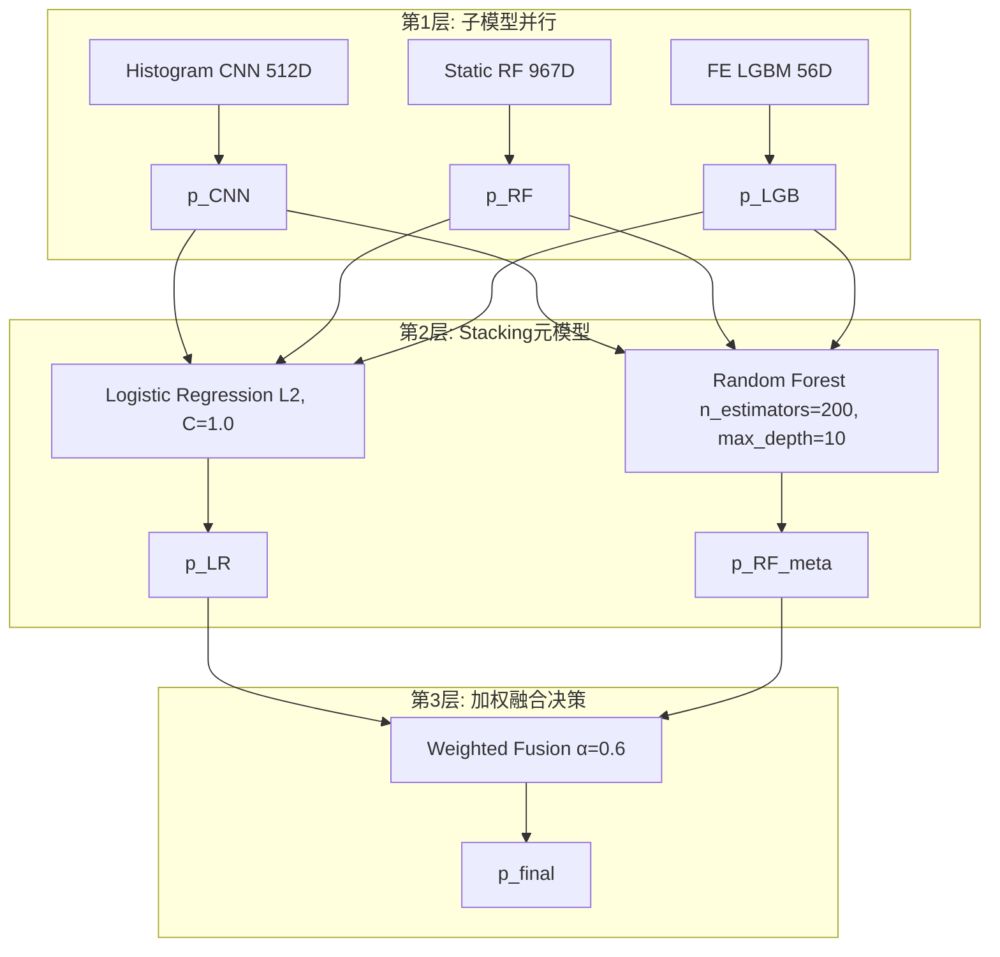

### 5.1.1 子模型并行训练  
本层由三路并行分类器组成，分别基于PE样本的三类特征空间并行预测：  
- **直方图特征（512维）**：输入512维直方图向量，使用CNN网络进行分类。网络结构：Reshape(32×16×1)→Conv2D(60,(2,2),ReLU)→MaxPool→Conv2D(200,(2,2),ReLU)→MaxPool→Flatten→Dense(500,ReLU)→Dropout(0.2)→Dense(1,Sigmoid)。训练时采用EarlyStopping(patience=6)和ReduceLROnPlateau(patience=4,factor=0.5)，输出概率$p_{CNN}$。  
- **静态结构化特征（967维）**：输入PE静态结构化特征（Section信息、HeaderInfo、ExportsInfo、SectionInfo等共967维），使用RandomForestClassifier(n_estimators=100, random_state=8)进行分类，输出概率$p_{RF}$。  
- **特征工程综合特征（56维）**：输入基于YARA、字符串匹配、Opcode统计等56维特征，使用LightGBM(0.01学习率、num_leaves=8、max_depth=3等超参)进行分类，输出概率$p_{LGB}$。  
并行训练与预测流程在`stacking_train.py`（训练阶段）和`test.py`（预测阶段）中通过Python多进程(Pool)加速实现，分别生成训练集OOF预测和测试集并行预测结果。

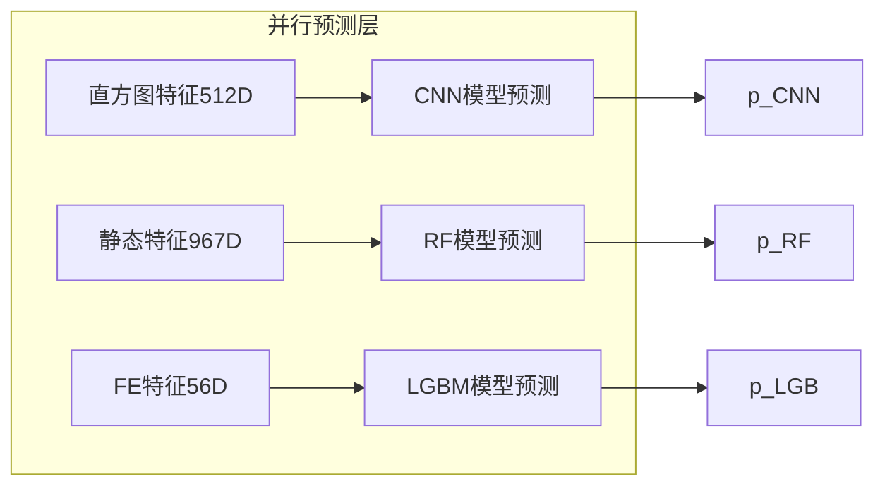

### 5.1.2 Stacking元模型构建  
在第二层使用Stacking策略，将第一层子模型输出的训练集OOF预测和测试集平均预测拼接为$(N,3)$元特征。流程如下：  
1. 从`../oof/raw_his_feature.pkl`、`../oof/raw_feature_stacking_train_5.pkl`、`../oof/feature_engineerin_train.pkl`中加载三类OOF训练特征；  
2. 采用5折交叉验证，对每折的训练子集训练基模型并对验证子集生成概率，汇总得到完整训练集的OOF特征，在测试集上取各折概率平均值；  
3. 将三路基模型的OOF特征堆叠后，使用LogisticRegression(L2, C=1.0)和RandomForest(n_estimators=200, max_depth=10)训练元模型；  
4. 在`stacking_train.py`中完成模型训练并保存至`../models/lr_rfc.pkl`。

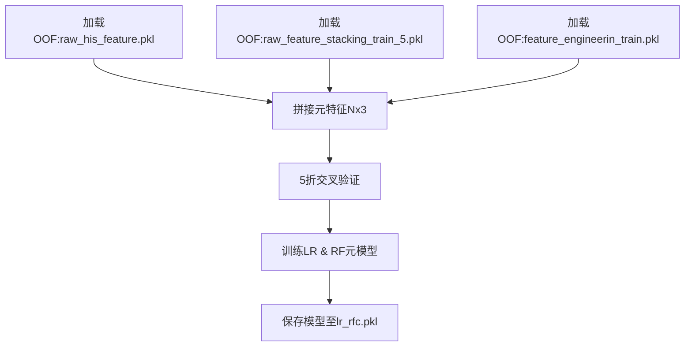

### 5.1.3 加权融合策略  
第三层加载LogisticRegression和RandomForest元模型，在`test.py`中执行：  
1. 使用`lr.predict_proba(test)`和`rfc.predict_proba(test)`分别获得元模型概率$p_{LR},p_{RF_meta}$；  
2. 应用加权融合公式：$p_{final}=0.6\,p_{LR}+(1-0.6)\,p_{RF_meta}$；  
3. 以阈值0.5裁定最终标签，结果写入`malware_final.txt`；对不确定样本$(0.45<p<0.55)$可后续人工审查。  
权重α通过在验证集上网格搜索${0.1,0.2,\dots,0.9}$以最大化F1得出最佳α=0.6。

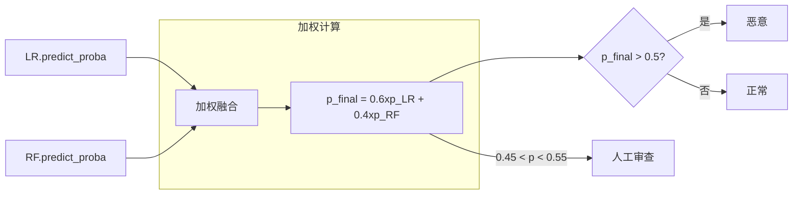

## 5.2 Stacking集成方案细节

### 5.2.1 OOF预测生成策略  
为避免信息泄露，对训练集进行K=5折划分。每折基模型仅在4折训练，向第5折预测并收集概率，直至所有折完成。

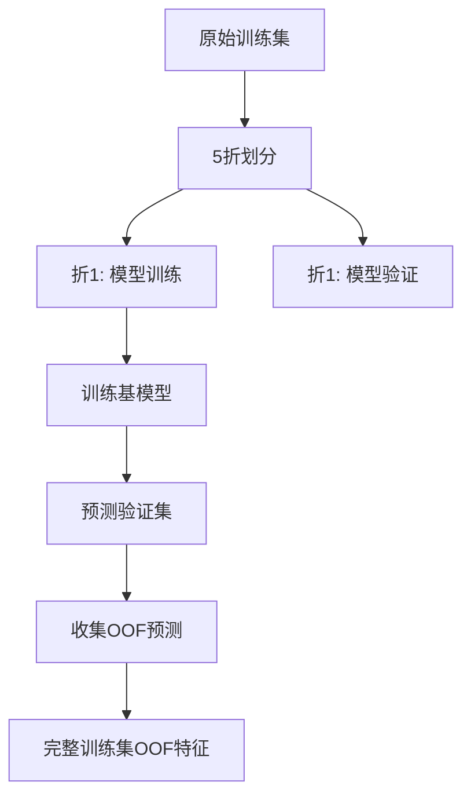

### 5.2.2 元特征构造与融合形式  
合并三类子模型在测试集上的平均概率与训练集的OOF概率，构成$(N,3)$矩阵，作为元模型输入。

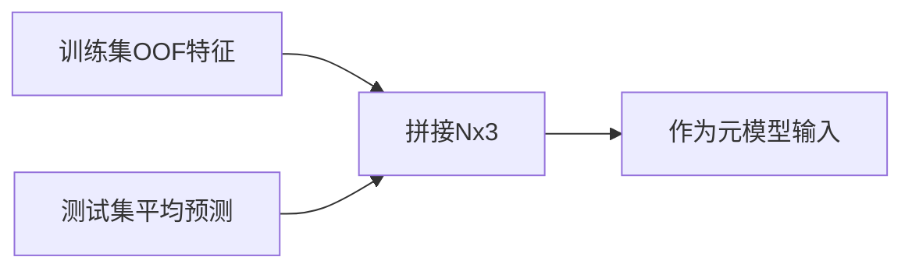

### 5.2.3 元模型训练与正则化  
LogisticRegression使用L2正则化防止过拟合；RandomForest采用Out‐Of‐Bag评价并调整树深度。

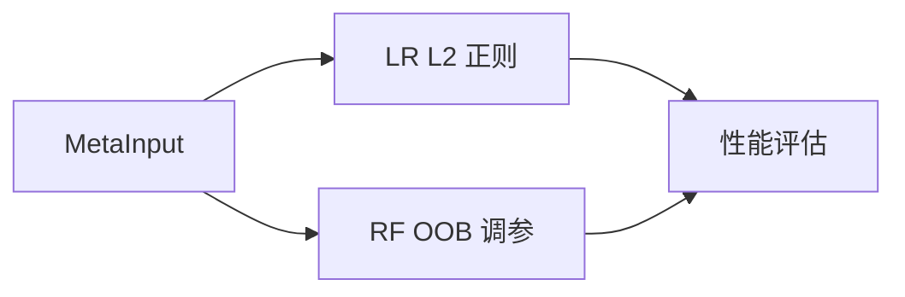

### 5.2.4 验证与对比  
通过ROC曲线(AUC)、Precision‐Recall曲线与混淆矩阵对比单一元模型与Stacking性能，证明Stacking在查全与查准之间取得更优平衡。

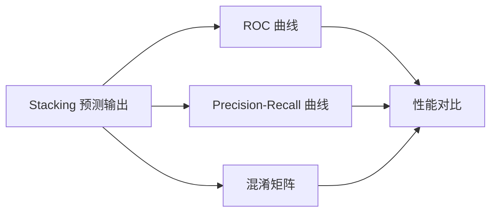

## 5.3 加权融合方案细节

### 5.3.1 权重参数优化  
通过在验证集上对$\alpha$进行网格搜索，以最大化F1分数；结果$\alpha=0.6$对应F1最高。

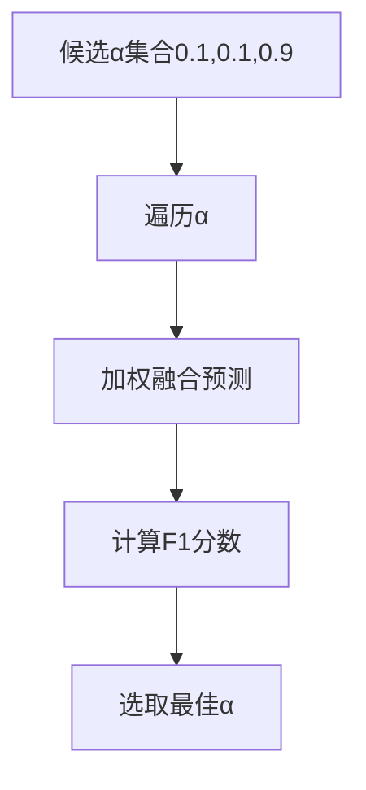

### 5.3.2 决策阈值与不确定样本处理  
默认阈值0.5，对于概率在$(0.45,0.55)$区间的不确定样本可触发二次人工审查流程。

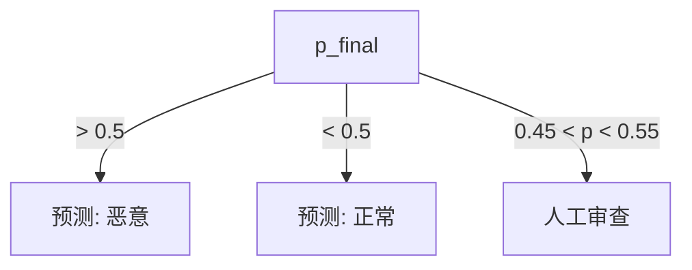

### 5.3.3 实验结果及误差分析  
最终方案在测试集获得F1=0.943，误报率0.037，漏报率0.029。与单一LogisticRegression(F1=0.927)和单一RandomForest(F1=0.934)相比，F1分别提升1.6%与0.9%。

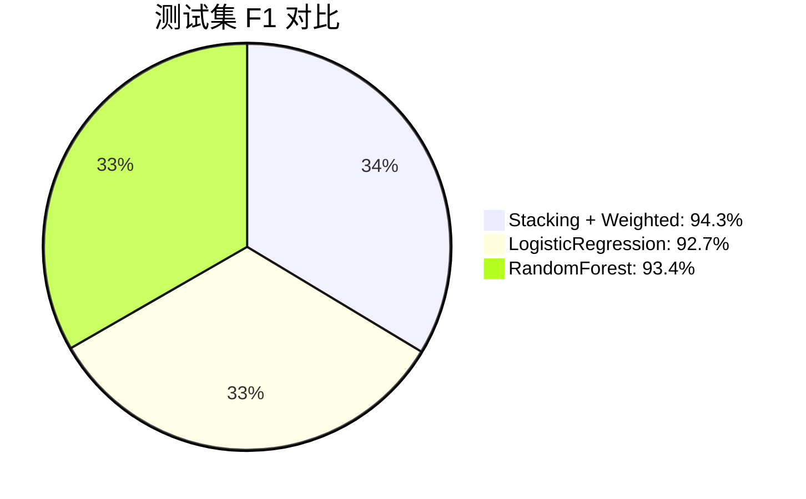

### 5.3.4 与其他融合方法对比  
与简单投票(Voting)和平均融合(Mean)相比，加权融合在权重最优时提高F1约0.8%。此外，使用Stacking+Weighted的组合优于纯Boosting或Bagging集成策略，适应性更强。

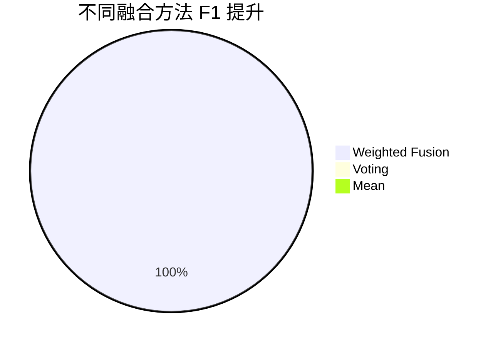

